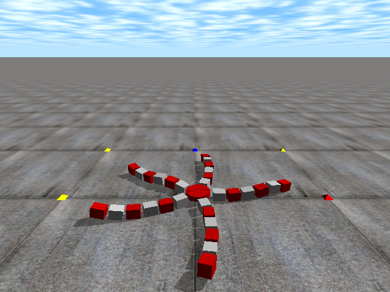

# roboSim

Given a system consisting of homogenous sub-systems with a set of behavior and constraints, we were interested in knowing how the interaction of the sub-systems can lead to emergence of system level behavior. In particular we considered the brittle star typed robot as a highly nonlinear dynamic control system, which is composed of homogenous modules (sub-systems). Each module incorporated an onboard micro controller for governing the behavior of the module, actuator for inducing motion, and touch sensors for feeling the environment. In this research we drew inspiration from emergent structures in nature and developed novel computational models for the motion control of the modular robot. Specifically, we leveraged off finite state machine, cellular automaton, and neural networks in developing novel motion control models. The optimal parameters for these models were evolved using genetic algorithm.

This is a repository for the brittle star robotic simulator using Open Dynamics Engine. It allows the user to experiment with different motion controllers, evolve motion control parameters, and visualize the robot's movement.

The following instructions for usage of this robotic simulator was complied and tested on MacOS 10.9.5 (Mavericks) and ODE 0.13.1. However it should be functional on other platforms given the open nature of the simulation environment. 

## Install open dynamics engine
To use this simulator you need to install [open dynamics engine] (https://bitbucket.org/odedevs/ode/) (ODE) for your platform. The default drawstuff library for rendering which comes as part of ODE is rather limited. I have modified the drawstuff library to enable simulation objects to be passed as argument for rendering. So you will need to replace the vanilla drawstuff library with the modified files (drawstuff.cpp and drawstuff.h) included in this repository.

1. Download ODE source from https://bitbucket.org/odedevs/ode/ into a suitable location, e.g. ode-0.13.1/
2. Place the robosim directory (this repository) under the ode directory, eg: .../ode-0.13.1/robosim
3. Replace ode-0.13.1/drawstuff/src/drawstuff.cpp with the drawstuff.cpp file from this repository (robosim/drawstuff/drawstuff.cpp).
4. Replace ode-0.13.1/include/drawstuff/drawstuff.h with the drawstuff.h file from this repository (robosim/drawstuff/drawstuff.h).
5. Make sure you are in the ode parent directory (e.g. ode-0.13.1/) and then configure and install ode as follows. Note we are disabling demos as it uses the vanilla drawstuff library which has now been replaced.

    $ ./configure --enable-double-precision --enable-release --disable-demos
  
    $ make

    $ sudo make install

##Performing simulations

In the robosim directory, compile the source and create the roboSim executable 

    $ make all

Run the simulator passing the parameter file (sfile.txt) as an input

    $ ./roboSim sfile.txt

##Simulator settings

The sfile.txt is the parameter file which governs how the simulations are performed. Through the parameters you can change the robot's structure, choose the motion controller, specify whether to evolve motion controller, or to visualize an evolved motion control     

###Robot structure
NUM_LEGS - number of legs in the robot 

NUM_MODS - number of modules per leg

NUM_BITS - number of bits to represent angular displacement of a module 

###ODE parameters
SIM_STEPSIZE - ODE simulation step size

TRANSITION_STEP - Defines the number of simulation steps in one state transition for the robot

NUM_STATE_TRANS - Number of state transitions; -1 for dynamic 

###Goal position
TARGET_LEN 0.02 - Target length (meters) 

TARGET_THETA 0 - Target angle (radians)

###Simulation mode
MODE - choose from visual, or evolve

###Robustness testing
BROKEN - 1 at the ith row and jth column indicates that corresponding module is broken 

###Input output files
RESULT_FILENAME - Output simulation result file

PARAM_FILENAME - Output file to store best evolved motion control parameters

IN_FILENAME - Input motion parameter file (used in visualization mode)

###Motion controller
CONTROLLER - select the motion controller from the following

* CA1d - Cellular Automata 1 dimensional
* CA2dSing - Cellular Automata 2 dimensional singular transition rule 
* CA2dDiff - Cellular Automata 2 dimensional differential transition rule
* NNSin - Neural network controller with sinusoidal activation function
* NNSig - Neural network controller with sigmoidal activation function				
* FSMdbl - Finite State Machine with discrete state of modules represented by integers
* FSMint - Finite State Machine with continuous state of modules represented by double

###General optimization settings
MAX_CHR_SIZE - maximum number of genes in chromosome

MIN_CHR_SIZE - manimum number of genes in chromosome

GLEN  - gene length = num_legs \* num_mods \* num_bits

CLEN - chromosome length; -1 for dynamic chromosome length

POP_SIZE - Population size  

MAX_GEN - Maximum number of generations for the evolutionary algorithm

SEED - seed for random number generator; -1 randomizes the seed

MR - GA mutation rate

CR - GA crossover rate

CLENCR - Control rule chromosome length for CA2dDiff controller  

CLENLR 16484 - Leg rule chromosome length for CA2dDiff controller 

  
###Fitness measure
PROBLEM_TYPE - choose from minimize or maximize depending on the objective function 

FITNESS_EVAL - choose from linear, directional or angular

OFFSET - used to transform maximization problem to minimization 

ALPHA - state weighting parameter for calculating fitness

###Differential Evolution algorithm settings
DE_STRATEGY - Choose DE strategy from (Rand1Exp, Rand1Bin, Best1Bin)

F - Weighting factor

## References

1. Lal S. P., Yamada K., Endo S.: Studies on motion control of a modular robot using cellular automata. In: Sattar, A., Kang, B. H., (eds.) AI 2006: Advances in Artificial Intelligence. Lecture Notes in Artificial Intelligence, vol. 4304, pp. 689–698. Springer, Heidelberg (2006) [ISBN: 978-3-540-49787-5] Presented at the 19th Australian Joint Conference on Artificial Intelligence, Hobart, Australia, 2006
2. Lal S. P., Uehara S., Futenma N., Yamada K., Endo S.: Studies on Athletic ability of modular robot. In: Proceedings of 2006 JSME Conference on Robotics and Mechatronics, No. 06-4, 2A1-E15. Tokyo (2006)
3. Lal S. P., Yamada K., Endo S.: Evolving Motion Control for a Modular Robot. In: Ellis, R., Allen, T., Petridis, M., (eds.) Applications and Innovations in Intelligent Systems XV. pp. 245–258. Springer, London (2007) [ISBN: 978-1-84800-085-8]
Presented at the 27th SGAI International Conference on Artificial Intelligence, British Computer Society, Cambridge, England, 2007.
4. Lal S. P., Yamada K.: Evolutionary Distributed Control of a Biologically Inspired Modular Robot. In: Iba H., (eds.) Frontiers in Evolutionary Robotics. pp. 543-566. I-Tech Education and Publishing, Vienna, Austria (2008) [ISBN: 978-3-902613-19-6]
5. Lal S. P., Yamada K., Endo S.: Emergent Motion Characteristics of a Modular Robot through Genetic Algorithm. In: Huang, D. S., Wunsch, D. C., Levine, D. S., Jo, K. H., (eds.) Advanced Intelligent Computing Theories and Applications: With Aspects of Artificial Intelligence. Lecture Notes in Artificial Intelligence, vol. 5227, pp. 225-234. Springer, Heidelberg (2008) 
[ISBN: 978-3-540-85983-3]
Presented at the 2008 International Conference on Intelligent Computing (ICIC2008), Shanghai, China
6. Lal S. P., Yamada K., Endo S.: Modeling and Simulation of Motion Control for Modular Robots. In: Proceedings of 9th SICE conference on System Integration, pp. 673-674. Gifu (2008)
7. Lal S. P., Yamada K., Endo S.: A novel approach towards controlling modular robotic systems. In: Proceedings of 18th Intelligent System Symposium (FAN), pp. 431-436. Hiroshima (2008)

